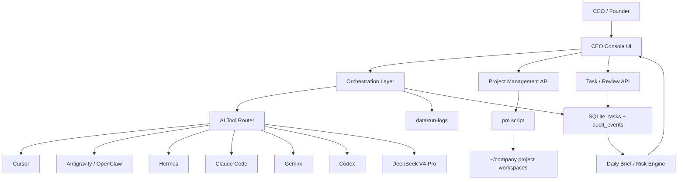

# AI Company OS Architecture

## Requirements Summary

Functional requirements:

- Integrate Cursor, Antigravity/OpenClaw, Hermes, Claude Code, Gemini, Codex, and DeepSeek V4-Pro as executable or routable AI workers.
- Manage business operating domains beyond engineering: project delivery, customer management, finance diagnosis, and marketing growth.
- Manage the full project lifecycle: create, design, develop, manage, progress, review, deliver, archive.
- Turn CEO intent into structured projects, milestones, tasks, acceptance criteria, and decision checkpoints.
- Dispatch tasks to the best available tool and record command, output, error, progress, and review state.
- Keep a local audit trail of decisions, task changes, dispatches, retries, and delivery events.
- Escalate only meaningful decision points to the CEO.

Non-functional requirements:

- Local-first and privacy-preserving by default.
- Must tolerate missing or unavailable AI tools.
- Must preserve logs and evidence for later review.
- Must be simple enough for one operator to maintain.
- Must avoid irreversible project operations without explicit confirmation.

## High-Level Architecture

## Core Components

### 1. CEO Console UI

The UI is the command center. It should show:

- Portfolio health
- Project governance
- Risk and reminders
- One-person company operating cockpit
- AI tool health
- Work queue
- Task detail and review
- Activity and audit trail

The UI should not behave like a generic task board. It should behave like an executive cockpit for AI-driven execution.

### 2. Orchestration Layer

The orchestration layer receives tasks and decides:

- Which AI tool should execute the task
- Whether a task can run headlessly
- Whether fallback is needed
- Whether retry is safe
- Whether CEO approval is required

Current implementation has a basic router in `server.py`. Future versions should introduce explicit planning, routing, and checkpoint models.

### 3. AI Tool Router

The router should classify tool strengths:

- Cursor: IDE-centered coding and codebase navigation
- Antigravity/OpenClaw: agentic local execution
- Hermes: cross-agent stewardship and multi-model routing
- Claude Code: deep code reasoning and implementation
- Gemini: broad reasoning and quick headless turns
- Codex: coding-oriented execution and repository work
- DeepSeek V4-Pro: low-cost drafts, structured summaries, simple code/test scaffolding, marketing/customer/finance first passes

Routing should consider task type, project context, tool availability, execution mode, past success rate, and required review depth.

### 4. Project Workspace Layer

Project creation, archive, restore, and delete remain aligned with the existing `pm` script and `~/company` workspace layout. This keeps CEO Console compatible with the broader one-person-company script system.

### 5. State and Evidence Layer

SQLite stores operational state:

- Tasks
- Execution state
- Dispatch attempts
- Review results
- Audit events

Run logs store execution evidence. Future delivery packaging should collect logs, changed files, summaries, screenshots, and acceptance results.

## Key Architecture Decisions

### ADR-001: Local-first monolith

Decision: keep the first production version as a local Flask + SQLite app.

Rationale:

- The CEO is one operator.
- Local tool access is essential.
- Simpler operations beat distributed complexity.
- SQLite is enough for local orchestration history.

Tradeoff:

- Multi-user collaboration is not first-class yet.
- Long-running orchestration needs careful process management.

### ADR-002: Tools are workers, not plugins only

Decision: treat Cursor, Antigravity/OpenClaw, Hermes, Claude Code, Gemini, Codex, and DeepSeek V4-Pro as AI workers with capabilities, availability, execution modes, and cost profiles.

Rationale:

- The platform goal is not merely launching tools.
- It must choose, dispatch, monitor, retry, and review work.

Tradeoff:

- Each tool has different CLI behavior and reliability.
- The router needs tool-specific adapters over time.

### ADR-003: CEO approval at decision checkpoints

Decision: automate execution but preserve CEO decisions at project, risk, review, and delivery checkpoints.

Rationale:

- A one-person CEO should not babysit every task.
- But business decisions and risk acceptance must remain human-owned.

Tradeoff:

- The system needs a clear checkpoint model to avoid both over-automation and constant interruption.

## Future Roadmap

1. Intent intake: CEO enters a project goal, platform creates a project plan.
2. Project blueprint: generate milestones, task graph, risks, acceptance criteria.
3. Tool router v2: route by task type and tool success history.
4. Decision checkpoints: explicit CEO approve/reject/redirect moments.
5. Delivery package: produce final release notes, evidence, logs, docs, and handoff checklist.
6. Knowledge memory: preserve reusable project decisions and patterns.
7. Autonomous daily operator: morning brief, execution plan, evening delivery report.

## Operating Model

CEO Console should implement the operating model described in [`operations-and-dispatch-playbook.md`](operations-and-dispatch-playbook.md).

The platform needs three control surfaces:

- Project panorama: portfolio status, priority, stage, owner, risk, next checkpoint.
- Task board: executable AI task cards with instructions, acceptance criteria, and review state.
- Decision log: human decisions that guide future AI execution.

The CEO interaction model is deliberately small:

- 看: dashboards, risk cards, AI patrol reports, and decision queues.
- 说: natural-language business goals, instructions, and review feedback.
- 点: approve, reject, retry, publish, merge, or confirm bookkeeping.

The platform also needs a tool routing layer:

| Stage | Primary Tools | Purpose |
| --- | --- | --- |
| Concept and design | Gemini, Claude Code | Research, alternatives, architecture, decision proposals |
| Core development | Antigravity/OpenClaw, Cursor, Codex, Claude Code, DeepSeek V4-Pro | Full-stack execution, precise edits, repetitive implementation, complex code, low-cost first passes |
| Review and acceptance | Gemini, Claude Code, Codex, CEO | Security review, code quality review, test/doc review, business acceptance |

| Business Domain | Primary Combination | Purpose |
| --- | --- | --- |
| Project delivery | Antigravity/OpenClaw -> Codex -> Claude Code/Gemini | Build, verify, review, and package delivery |
| Customer management | Hermes -> Gemini -> DeepSeek V4-Pro -> Claude Code | Triage messages, draft replies, review contracts |
| Finance diagnosis | Gemini -> DeepSeek V4-Pro -> Claude Code -> Codex | Normalize receipts, classify spend, forecast cashflow |
| Marketing growth | Gemini -> DeepSeek V4-Pro -> Claude Code -> Hermes | Research topics, draft content, polish, monitor social channels |

The CEO should be interrupted only for:

- Product direction decisions
- Architecture tradeoffs
- Risk acceptance
- Delivery approval
- Repeated execution failure

## Risks and Mitigations

- Tool CLI instability: isolate tool adapters and keep fallback paths.
- Over-automation: require CEO checkpoints for irreversible or business-sensitive actions.
- Log overload: summarize logs and keep raw logs available.
- Local permission issues: prefer `~/company`, expose health checks, document launchd permissions.
- Context fragmentation: store project plans, acceptance criteria, decisions, and audit events centrally.
